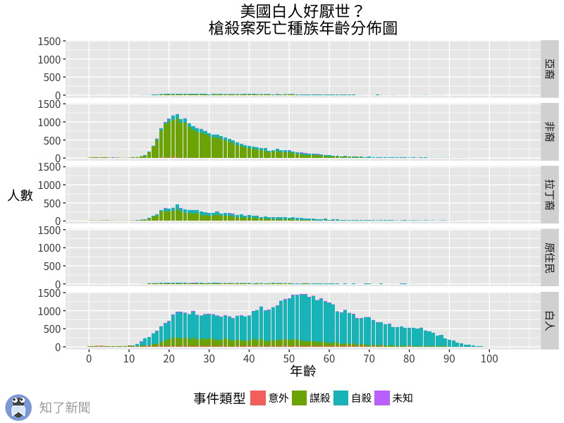

# 使用R進行視覺化吧！

用R進行資料整理與視覺化的工作坊的講義們在此！

- 資料集下載：[dropbox](http://bit.ly/2mEV5nk) （Windows使用者請載註明`big5`的檔案，pokemon.csv及guns.csv是全英文檔案，應該不會有編碼問題）
- 閱讀講課[投影片](https://cicadatatw.github.io/r-viz-workshop/)

## RStudio快捷鍵們

[All RStudio keyboard shortcuts](https://support.rstudio.com/hc/en-us/articles/200711853-Keyboard-Shortcuts)

功能                    | Windows & Linux    | Mac
----------------------- | ------------------ | --------------------
顯示快捷鍵              | Alt+Shift+K        | Option+Shift+K
自動補完	              | Tab or Ctrl+Space  | Tab or Command+Space
執行（單行／選取範圍）  | Ctrl+Enter         | Command+Enter
註解（單行／選取範圍）  | Ctrl+Shift+C       | Command+Shift+C
存擋                    | Ctrl+S             | Command+S
縮排                    | Ctrl+I             | Command+I

## R是什麼東西R：Summit SHOW TIME

這邊可以先不用跟著做，但提供 code 給大家參考

### 如果要跟著做，可以先偷安裝一下套件：tidyverse

安裝：（如果已經安裝過就可以挑過這個步驟囉）

	install.packages("tidyverse")

載入：

	library("tidyverse")

### 先把 R 當成計算機

先來考考他～～數學好不好～～<del>應該是比我好</del>

	1 + 1

感覺沒什麼問題，那三角函數呢？

	sin(2017)

白色情人節剛過，也來拍一下吧

	pi

### 統計是看家本領

當然也可以輕輕鬆鬆跑檢定：

	# Kolmogorov-Smirnov Tests
	ks.test(iris$Sepal.Length, iris$Petal.Length)

冷冰冰的數字不好玩，來畫個圖吧：

	plot(density(iris$Sepal.Length), xlim = range(c(iris$Sepal.Length, iris$Petal.Length)), main = "Sample PDF")
	lines(density(iris$Petal.Length), col = 2)

### A/B Testing（媒體、電子商務、流量成長駭客必備工具

我們的 APP 推出了改版，要比較新舊 UI 功能的成效；於是 sample 了一群 user 試用新介面（功能）

- 新介面（功能）：在  3000 點擊有 10 個購買
- 舊介面（功能）：在 50000 點擊有 30 個購買

#### 我怎麼知道這兩種方法的轉換率（購買／點擊）是不是明顯不同？

先安裝二項分配的套件：

	install.packages("binom")

然後呼喚他：

	library(binom)

來問問檢定這兩個方法的轉換率是否不同吧：

	# Binomial confidence intervals
	binom.confint(c(10, 30), c(3000, 50000), methods = "exact")

## R基礎語法

### 向量式的運算

R的主打就是向量式的運算，什麼？你說請講中文？好吧那廢話不多說讓我們直接來看看R會吐什麼給我們，請分別輸入以下指令：
	
	c(1, 2, 3, 4) + 1
	c(1, 2, 3, 4) + c(2, 3, 4, 5)
	c(1, 2, 3, 4) + c(2, 10)

### R的哲學

*To understand computations in R, two slogans are helpful:*

- *Everything that exists is an object.*
- *Everything that happens is a function call."*

*— John Chambers*

#### R的神秘符號們

未完待續：

	`+`

把值存進某個變數：

	`<-`

取子集：

	`[`

向量：

	`c`

### 什麼是 `function call`？

	1 + 1

等於：

	`+`(1, 1)

`+` 就是一個 function

### 沒關係不重要，搞懂Dataframe就好

（直翻）資料框，就是表格的意思啦

#### 所以那是什麼東西 =_=

還是直接來看看吧。先來載入運動的資料集：

	install.packages("Lahman")
	library(Lahman)

撈一下已經不紅的（？）王葛格的資料：

	wang <- hing %>% filter(playerID == "wangch01") %>% arrange(desc(yearID))

呼喚他的名字：

	wang

看起來大概差不多就是長這種樣子（？）

## 一起來玩R

### 首先安裝／載入今天要使用使用的套件，懶人大禮包：`tidyverse`

大禮包內含：

安裝：（如果已經安裝過就可以挑過這個步驟囉）

	install.packages("tidyverse")

載入：

	library("tidyverse")

## 開始用ggplot2畫圖八！

### 讀入資料 

- [臺北市政府警察局交通警察大隊/交通事故資料](http://data.taipei/opendata/datalist/datasetMeta?oid=2f238b4f-1b27-4085-93e9-d684ef0e2735)
- 使用**readr**的**read_csv**函數，而不是內建的**read.csv**

我們把資料讀進來，存在`traffic`這個變數裡。

	traffic <- read_csv("traffic_eng.csv")

接著一起來看看這個檔案長什麼樣子。用`head()`來看檔案的前幾行，括號內的第一個argument填入我們想看的資料`traffic`，`n=3` 則是告訴R我們想看前三行。

	head(traffic, n=3)

### 探索資料　 

- 看一下時間分佈好了

用`select()`選擇`time.month`、`time.day`、`time.hour`、`time.minute`這四個欄位，然後用`summary()`看一下各欄位的基本統計值。

	traffic %>%
	    select(time.month, time.day, time.hour, time.minute) %>%
	    summary()

看的出來是24小時制的紀錄方式，但如果想知道整體分配，這樣好像看不出什麼貓膩。改用`group_by()`來看看。這個函數可以把資料按照指定欄位——在這裡我們指定的是`time.hour`——分組排好，然後再用`count()`來計算每一組裡面有幾筆資料。最後把資料存在`pivot.time.hour`這個變數裡。

	traffic %>%
	    group_by(time.hour) %>%
	    count() -> pivot.time.hour

接著來看看剛剛分好組的資料：

	pivot.time.hour %>% head(5)

用肉眼雖然可以大致看出多少，但對各組之間相對的大小好像還是沒什麼概念，這時候就需要畫張圖來看看啦。
 
### 用ggplot2畫圖+探索資料

首先，用`ggplot`開一張畫布，並且存在`qq`裡，指定資料來自剛剛製作的`pivot.time.hour`：

	qq <- ggplot(data = pivot.time.hour)

接著告訴R我們要畫長條圖`geom_bar`，用`aes()`指定x軸跟y軸。在此x軸使用`time.hour`這個欄位，y軸使用`n`，資料已經計算好個數，`stat = "identity"`指定使用的數據是已算好的結果：

	qq <- qq + geom_bar(aes(x=time.hour, y=n), stat = "identity")

但東西畫到哪去了呢？用`print()`把他呼喚出來：

	print(qq)

### ggplot and Grammar of Graphics

- ggplot遵循一套稱為"Grammar of Graphics"的設計準則，將圖表拆解成許多元素
- 疊圖!
- **aes()**代表了"Aesthetic mapping"，指定那些看的見的元素
- 位置(x, y)、顏色(color, fill)、形狀(shape)、大小(size)......
- **geom_**系列的函數，決定"Geometric object"，這些元素最後組成什麼圖表
- 長條圖(bar)、散點圖(point)、折線圖(line)......etc.

#### 實際來玩弄一下

圖表的類型可以輕易的被改變，利用折線圖**geom_line()**取代長條圖**geom_bar()**

	qq <- ggplot(data = pivot.time.hour)
	qq <- qq + geom_line(aes(x=time.hour, y=n))
	print(qq)

當然也可以疊圖，在原本的圖上加上資料點：

	qq <- qq + geom_point(aes(x=time.hour, y=n))
	print(qq)

### 探索資料，more！

- <s>來戰南北囉啊不對這是台北市的資料</s>
- 那就戰男女!!! 把剛才的時序資料，按照性別分開

先整理資料，用`time.hour`和`party.gender`來分組並且計數：

	traffic %>% 
	    group_by(time.hour, party.gender) %>% 
	    count() -> pivot.hour.gender

然後看整理好的資料一眼：

	pivot.hour.gender %>% head(3)

接著就可以來畫圖啦：

	qq <- ggplot(data = pivot.hour.gender)
	qq <- qq + geom_line(aes(x=time.hour, y=n, colour=party.gender))
	print(qq)

- **aes()**中依舊包含關於位置的資訊(x, y)，但是這次有新朋友**colour=party.gender**
- 本來都是一樣的黑色，那顏色本身能不能包含資訊呢?
- **colour=party.gender**代表「利用性別這個欄位，著上不同的顏色！」
- colour, size, shape......等等，都可以用這種方式呈現！拿來做分類的標示

#### 可是我的圖變成外星文ㄌ怎麼辦

- R是洋人的玩意ㄦ，ggplot也是......<s>八月丨五殺韃了!!!!</s>
- 預設字型，顯示不了中文！
- 需要指定可以兼容的字型，交給**theme()**來處理這些資料以外的問題！

	qq <- ggplot(data = pivot.hour.gender)
	qq <- qq + geom_line(aes(x=time.hour, y=n, colour=party.gender))
	qq <- qq + theme(text=element_text(family = "Microsoft JhengHei", 
	                                   colour="red"))
	print(qq)

如果是Mac用戶，請把紅色的字型部分改成`"STHeiti"`。

#### 圖上的字型，現在都變成微軟正黑體/蘋果黑體的形狀啦!

### 這還不夠好！

#### 把這張圖交出去的話會被電<s>沒被電的話你要懷疑你上司的程度</s>

### 問題在哪裡？

- 沒有圖表標題
- x軸與y軸是什麼意思?
- x軸想要每3個小時畫一個標記，y軸的字能不能轉向?
- 圖例補上標題，放在底下

#### 來加上標題、座標軸吧

前面一樣開圖、設定字型：

	qq <- ggplot(data = pivot.hour.gender)
	qq <- qq + geom_line(aes(x=time.hour, y=n, colour=party.gender))
	qq <- qq + theme(text=element_text(family = "Microsoft JhengHei"), # 不是Windows用戶記得改字型蛤
	                 axis.title.y = element_text(angle = 0, vjust = 0.5), 
	                 legend.position = "bottom") 

加上標題跟座標軸：

	qq <- qq + labs(title="台北市每時交通事故人數，按性別分",
	                x="時間", y="人數")

設定x軸的範圍：

	qq <- qq + scale_x_continuous(breaks = seq(0,24,3))

加上圖例的標題：

	qq <- qq + scale_colour_discrete(name="當事人性別")

來看看：

	print(qq)

## 去吧！我已經把我的寶藏藏在那裡了！

- 試試看利用簡單的敘述統計跟ggplot，探索一下這筆資料吧!
- 畫個「分鐘」的長條圖，你會發現警察登記時的習性

除了這個資料，我們準備了一些有趣的東西可以玩：

- 20年的大學榜單資料（已經請大家預先下載了）
- [700 隻寶可夢的基本資料](https://www.dropbox.com/s/fk1v07mjphs4vno/Pokemon.csv?dl=0)（From [Kaggle](https://www.kaggle.com/datasets)）
- [美國殺人案件資料](https://www.dropbox.com/s/83oa5ubgbhywych/guns.csv?dl=0)（From [Kaggle](https://www.kaggle.com/datasets)）

#### 自由探索資料，等等上台分享～

## 示範資料作圖區

### 槍殺資料 `guns.csv`

- 檔案：gg_guns_race.R

# 讀入檔案
guns <- read.csv("~/Downloads/guns.csv")

	# 調整
	levels(guns$race)
	# # [1] "Asian/Pacific Islander"         "Black"                         
	# # [3] "Hispanic"                       "Native American/Native Alaskan"
	# # [5] "White"  
	levels(guns$race) <- c("亞裔", "非裔", "拉丁裔", "原住民", "白人")
	levels(guns$race)
	# # [1] "亞裔"   "非裔"   "拉丁裔" "原住民" "白人" 

	levels(guns$intent)
	# # [1] "Accidental"   "Homicide"     "Suicide"      "Undetermined"
	levels(guns$intent) <- c("意外", "謀殺", "自殺", "未知")
	levels(guns$intent)
	# # [1] "意外" "謀殺" "自殺" "未知"

	# 美國白人好厭世？
	gg <- ggplot(data = guns)
	gg <- gg + geom_bar(aes(x = age, fill = intent))
	gg <- gg + facet_grid(race ~.)
	gg <- gg + scale_x_continuous(breaks = seq(0,100,10))
	gg <- gg + scale_fill_discrete(name="事件類型")
	gg <- gg + theme(text=element_text(family="Noto Sans CJK TC", size=14), 
	                 # 如果沒有安裝思源黑體，Windows 請用 "Microsoft JhengHei" / Mac 請用 "STHeiti"
	                 axis.title.y = element_text(angle = 0, vjust = 0.5),
	                 legend.position = "bottom")
	gg <- gg + labs(y = "人數", x = "年齡", title = "美國白人好厭世？\n槍殺案死亡種族年齡分布圖")
	print(gg)